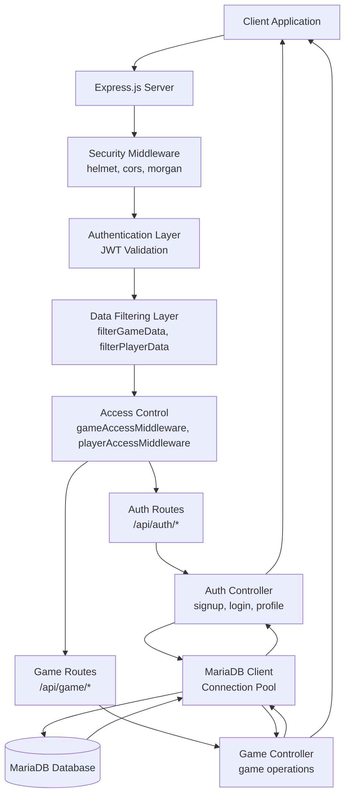
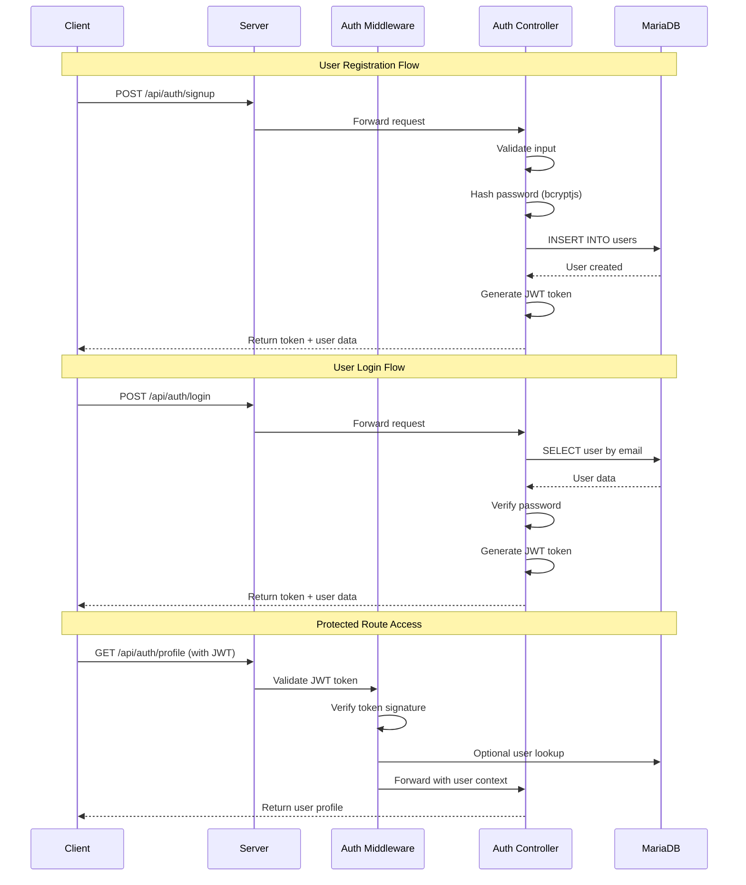
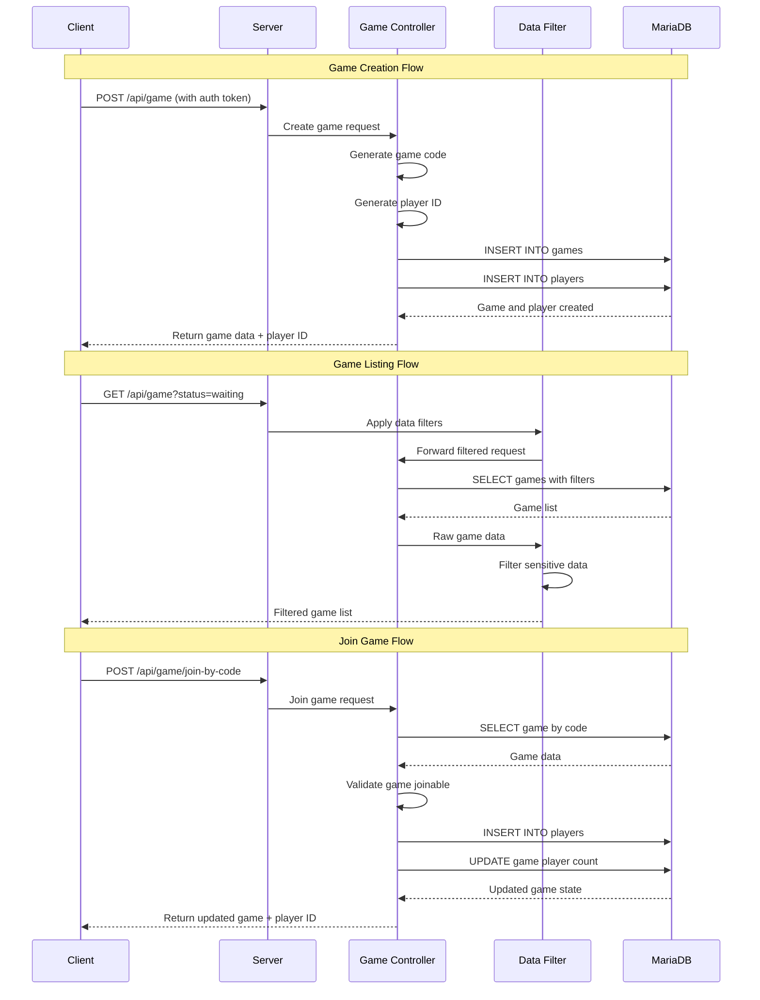
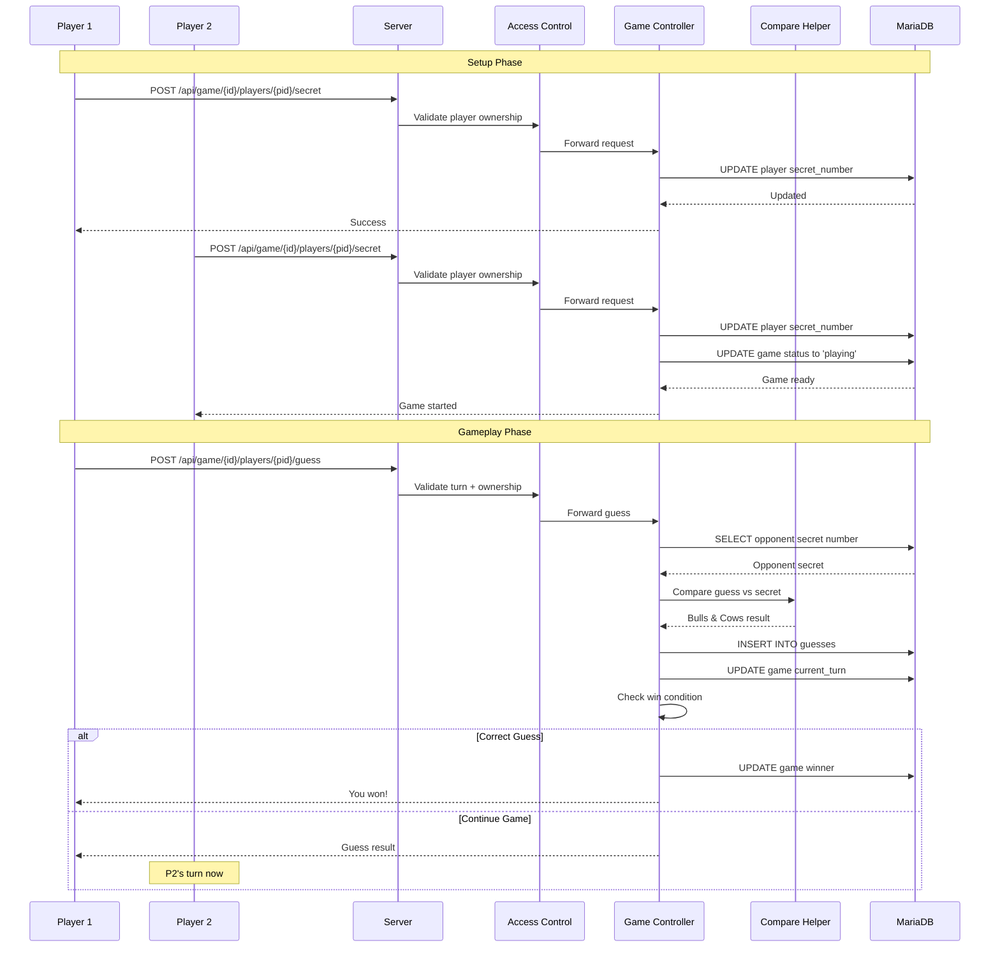
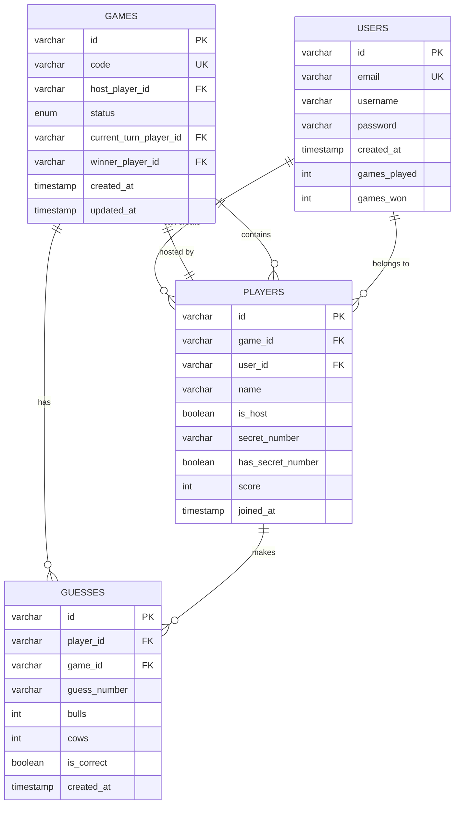
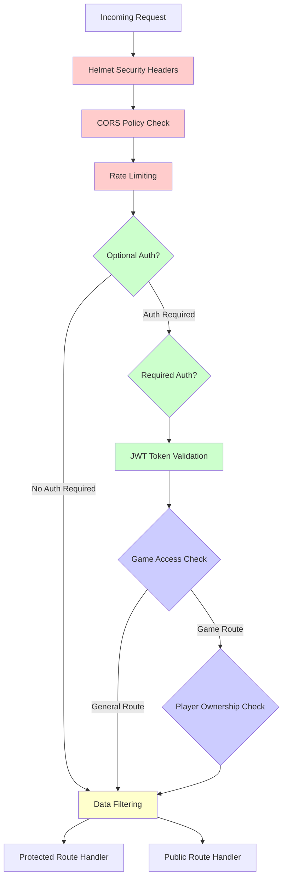
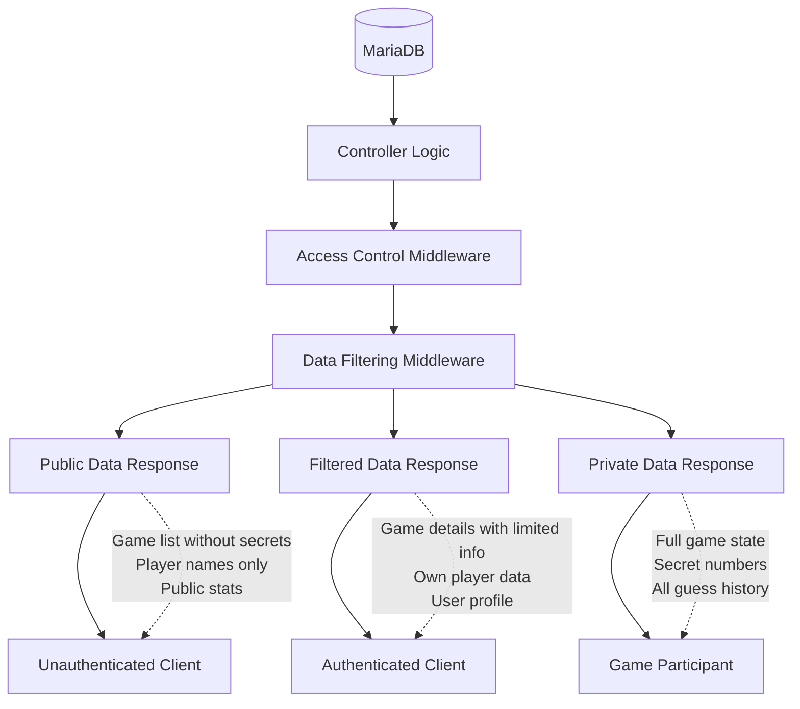
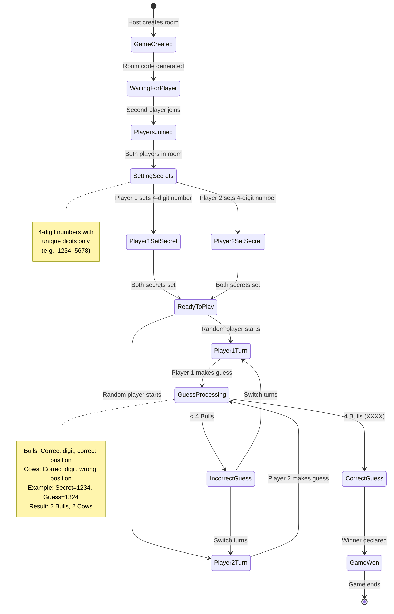
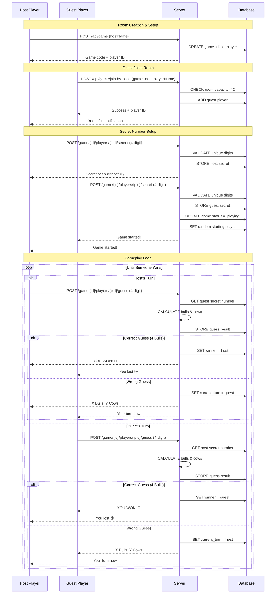
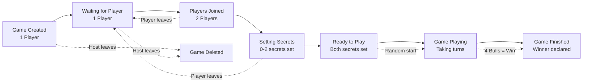

# Bulls and Cows Game - Data Flow Diagram

## System Architecture Overview



## Authentication Data Flow



## Game Creation and Management Flow



## Gameplay Data Flow



## Database Schema and Data Relationships



## Security and Access Control Flow



## API Response Data Flow



## Bulls and Cows Game Rules & Flow

### **Core Game Mechanics**

- **Room Capacity**: Exactly 2 players per game room
- **Secret Numbers**: Each player sets a unique 4-digit number (no repeated digits)
- **Objective**: Guess the opponent's 4-digit secret number
- **Win Condition**: First player to correctly guess wins the game
- **Scoring**: Bulls (correct digit in correct position) + Cows (correct digit in wrong position)



### **Detailed 2-Player Game Flow**



## Key Data Flow Patterns

### 1. **Authentication Flow**

- **Input**: Email/username + password
- **Process**: Hash validation → JWT generation
- **Output**: JWT token + user profile
- **Storage**: User credentials in MariaDB

### 2. **Game Room Management Flow**

- **Input**: Game code + player name
- **Process**: Validate room capacity (max 2) → Check duplicate names → Add player
- **Output**: Updated game state + player ID
- **Storage**: Player record linked to game room
- **Rules**:
  - ✅ Maximum 2 players per room
  - ✅ Unique player names within room
  - ✅ Room must be in "waiting" status to join

### 3. **4-Digit Secret Number Flow**

- **Input**: 4-digit number string
- **Process**: Validate unique digits → Store encrypted → Check if both players ready
- **Output**: Game status update (waiting → ready → playing)
- **Storage**: Secret number in player record
- **Rules**:
  - ✅ Exactly 4 digits
  - ✅ All digits must be unique (no repeats)
  - ✅ Valid examples: "1234", "5678", "9021"
  - ❌ Invalid examples: "1123", "555", "12345"

### 4. **Guess Processing & Win Detection Flow**

- **Input**: 4-digit guess number
- **Process**: Validate guess → Compare with opponent's secret → Calculate bulls/cows → Check win
- **Output**: Guess result + game state update + winner declaration
- **Storage**: Guess record + updated game state
- **Win Logic**:
  - 🎯 **4 Bulls** = Correct guess = **WINNER!**
  - 🐂 **Bulls**: Correct digit in correct position
  - 🐄 **Cows**: Correct digit in wrong position
  - 🔄 **Turn Switch**: If not winner, opponent's turn

### 5. **Game Room States & Transitions**



### 6. **Data Filtering Flow**

- **Input**: Raw database records
- **Process**: Apply user context → Filter sensitive fields
- **Output**: Appropriate data level for user
- **Rules**: Based on authentication status and game participation

### 7. **Access Control Flow**

- **Input**: Request with user context
- **Process**: Validate permissions → Check ownership
- **Output**: Allow/deny + appropriate data scope
- **Levels**: Public → Authenticated → Game participant → Player owner

## Environment Configuration

```bash
# Database Configuration
DB_HOST=localhost
DB_PORT=3306
DB_USER=game_user
DB_PASSWORD=secure_password
DB_NAME=guess_the_number

# Authentication Configuration
JWT_SECRET=your_jwt_secret_key_here
JWT_EXPIRES_IN=24h

# Server Configuration
PORT=3000
NODE_ENV=development
```

This data flow diagram illustrates the complete journey of data through your Bulls and Cows game backend, from client requests through security layers, authentication, business logic, and database storage, ensuring proper access control and data protection at each stage.
